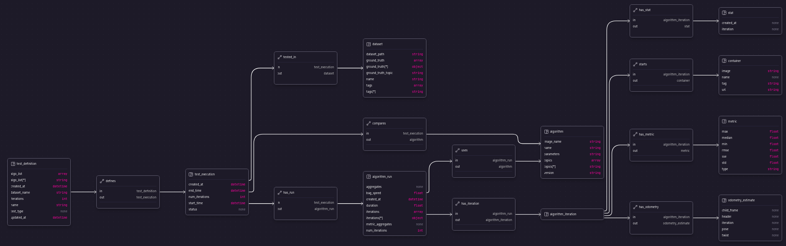

# RUSTLE -  Reliable User-friendly and Simple Tests for Localization Experiments - Work In Progress

## Getting Start

### Using Nix

The easiest way to start is with the [nix package manager](https://nixos.org/)

You can install the Nix package manager with:
```
sh <(curl -L https://nixos.org/nix/install) --daemon
```
Then, in the directory of the rust project just run:
```
nix develop
```
This will install every dependency needed and link them into your current shell. Be carefull, as the dependencies will not 
be available elsewhere! If you need the dependencies in multiple terminal windows you should use the nix shell command in
all of them.

### Non-nix instalation

You need to install manually the following dependencies:
- [evo](https://github.com/MichaelGrupp/evo)
- pkg-config
- fontconfig
- [surrealdb](https://surrealdb.com/install)


### Initial developing dataset

It is also required to download a rosbag dataset to start working with this tool. During initial development I am using the the [park_dataset.bag](https://drive.google.com/drive/folders/1gJHwfdHCRdjP7vuT556pv8atqrCJPbUq) (3.22GB) from the [Botanic Garden dataset](https://github.com/robot-pesg/BotanicGarden).

## Running code


To start running this tool you need to provide the following YAML files:
- datasets.yaml
- algorithms.yaml
- tests.yaml

Examples of these files:

```yaml
#datasets.yaml
datasets:
  - name: "botanic_garden"
    ground_truth_topic: "/gt_poses"
    dataset_path: "/home/mjpc13/Documents/rustle/test/dataset/"
    tag: ["Botanic"]
```

```yaml
#algorithms.yaml
algorithms:
  - name: "ig-LIO"
    version: "1.0"
    image_name: "mjpc13/rustle:ig-lio"
    parameters: "/home/mjpc13/Documents/rustle/test/config/ig-lio/params.yaml"
    odom_topics: ["/lio_odom"]

  - name: "LIO-SAM"
    version: "2.1"
    image_name: "mjpc13/rustle:lio-sam"
    parameters: "/home/mjpc13/Documents/rustle/test/config/lio-sam/params.yaml"
    odom_topics: ["/lio_sam/mapping/odometry_incremental"]
```

```yaml
#tests.yaml
test_definitions:
  - name: "Simple Test"
    workers: 2
    iterations: 2
    algo_list: ["ig-LIO", LIO-SAM]
    dataset_name: "botanic_garden"
    test_type:
      type: simple

  - name: "Performance Stress Test"
    workers: 1
    iterations: 1
    algo_list: ["ig-LIO"]
    dataset_name: "botanic_garden"
    test_type: 
      type: speed
      speed_factors: [1.0, 2.0, 4.0]
```


To run the code with all log levels use:
```
RUST_LOG=rustle cargo run
```

## Project Structure

This is a high-level view of the codebase:
```bash
├── Cargo.toml
├── docker/ --> Folder for the dockers of different algorithms
│   ├── lio-sam/
│   │   ├── Dockerfile --> Dockerfile to build the algorithm
│   │   └── rustle.launch --> Default launch for the algorithm
│   └── ig-lio/
│       ├── Dockerfile
│       └── rustle.launch
├── src/ -> Folder where the main code is stored
│   ├── db/ -> Handles access/requests to the database
│   ├── models/ -> defines the structs/objects used in RUSTLE
│   │   ├── metrics/ --> Structs for different metrics
│   │   └── ros/ --> Structs to define/parse different ROS messages
│   ├── services/ -> Contains the main business logic
│   │   └── errors.rs -> file where our custom errors are declared
│   ├── utils/ -> Contains some usefull functions/methods
│   │   └── evo_wrapper.rs --> Wrapper on the EVO tool
│   ├── lib.rs -> library API file
│   ├── main.rs -> execution file
│   └── task.rs -> Responsible to create and run the algorithms and statistics
└── test/ -> folder with some configurations to test in development
    └── config/
        └── params.yaml
    └── dataset/
        └── park_dataset.bag
```

### Database structure




## Developing guides

### Access the database

If you chose to use nix you have a nice command available:
`rustle_db`

This spins an instance of test/db/ (the default location of the surreal database). To connect to the database instance use an 
application such as [surrealist](https://surrealist.app/c/oro4XQ0Oq/designer) and start a new connection in *localhost*. The user and password are both *root*. Now you are free to see, add, delete the database records.

If you are not using nix, use the following command:
```
surreal start --log debug --user root --pass root "rocksdb://$RUSTLE_ROOT/test/db/"
```

### Clean residual artifacts

If you are using nix you can run the clean command to clean **ALL** the docker containers, the database and the results.

```
rustle_clean
```