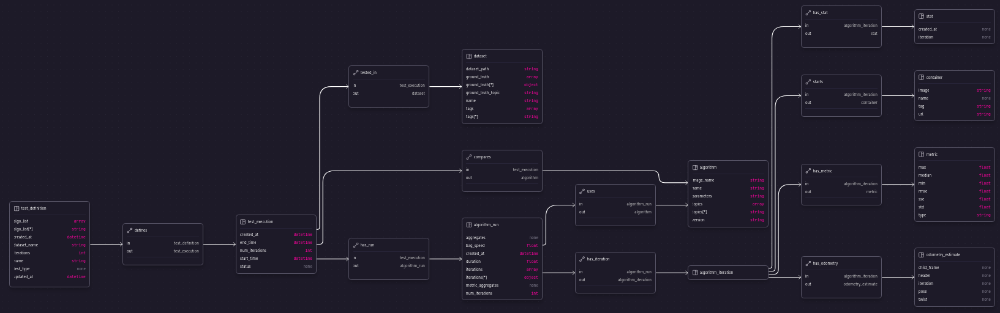

# RUSTLE -  Reliable User-friendly and Simple Tests for Localization Experiments - Work In Progress

## Getting Start

### Using Nix

The easiest way to start is with the [nix package manager](https://nixos.org/)

You can install the Nix package manager with:
```
sh <(curl -L https://nixos.org/nix/install) --daemon
```
Then, in the directory of the rust project just run:
```
nix develop
```
This will install every dependency needed and link them into your current shell. Be carefull, as the dependencies will not 
be available elsewhere! If you need the dependencies in multiple terminal windows you should use the nix shell command in
all of them.

### Non-nix instalation

You need to install manually the following dependencies:
- [evo](https://github.com/MichaelGrupp/evo)
- pkg-config
- fontconfig
- [surrealdb](https://surrealdb.com/install)


## Running code


To start running this tool you need to provide add datasets, algorithms and tests to RUSTLE db, check the **examples/** folder for some examples.

Example workflow is as follows:
- Add a dataset, algorithm or tests:
```
cargo run -p rustle-cli [dataset, algo or test] add -f examples/my_config_file.yaml
```
- Run a selected test:
```
cargo run -p rustle-cli test run simple_test
```
- Show results for a previously ran test:
```
cargo run -p rustle-cli test show simple_test
```
- Plot results for a previously ran test:
```
cargo run -p rustle-cli test plot simple_test -o ./my_output_directory_name
```

## Uninstall and Remove RUSTLE

```bash
$ rm -r ~/.local/share/rustle/ ~/.config/rustle 
```

## Developing guides

### Initial developing dataset

It is also required to download a rosbag dataset to start working with this tool. During initial development I am using the the [park_dataset.bag](https://universidadedecoimbra154-my.sharepoint.com/:u:/g/personal/uc2016231181_student_uc_pt/EQ1Pj805USlMi8wgONFK_h8BKGQuJhqFv7HvIf-qt5v0Tg) (3.22GB) from the [Botanic Garden dataset](https://github.com/robot-pesg/BotanicGarden).

### Project Structure

This project is divided into two main libraries, one implementing the API and a 
other responsible for the **CLI** application:

```bash
├── Cargo.toml
├── docker/ --> Folder for the dockers of different algorithms available for RUSTLE
│   ├── lio-sam/
│   │   ├── Dockerfile --> Dockerfile to build the algorithm
│   │   └── rustle.launch --> Default launch for the algorithm
│   │   [...]
│   └── ig-lio/
│       ├── Dockerfile
│       └── rustle.launch
├── cli/ --> Library that handles the command line interface
├── core/ --> Library that handles RUSTLE API
├── examples/ --> Examples folder, contains example datasets, algos, tests, etc...
│   ├── config/ -> Config file examples of SLAM parameters for each method 
└── images/ -> Folder with images used to display in this README
```


This is a high-level view of the `core/` API codebase:
```bash
├── Cargo.toml
├── src/ -> Folder where the main code is stored
│   ├── db/ -> Handles access/requests to the database
│   ├── models/ -> defines the structs/objects used in RUSTLE
│   │   ├── metrics/ --> Structs for different metrics
│   │   └── ros/ --> Structs to define/parse different ROS messages
│   ├── services/ -> Contains the main business logic
│   │   └── errors.rs -> file where our custom errors are declared
│   ├── utils/ -> Contains some usefull functions/methods
│   │   └── evo_wrapper.rs --> Wrapper on the EVO tool
│   └── lib.rs -> library API file
└
```

### Database structure and Access

The database structure is:



If you chose to use nix you have a nice command available:
`rustle_db`

This spins an instance of .local/share/rustle/db/ (the default location of the surreal database). To connect to the database instance use an 
application such as [surrealist](https://surrealist.app/c/oro4XQ0Oq/designer) and start a new connection in *localhost*. The user and password are both *root*. Now you are free to see, add, delete the database records.

If you are not using nix, use the following command:
```
surreal start --log debug --user root --pass root "rocksdb:~/.local/share/rustle/db/"
```

### RUSTLE Generated data

The RUSTLE generated config file is by default stored in `~.config/rustle/`. 

The database by default is stored at `~/.local/share/rustle/db/` and some complementary
data is in `~/.local/share/data/`.

### Clean residual artifacts

If you are using nix you can run the clean command to clean **ALL** running docker containers, the database and the results.

```
rustle_clean
```